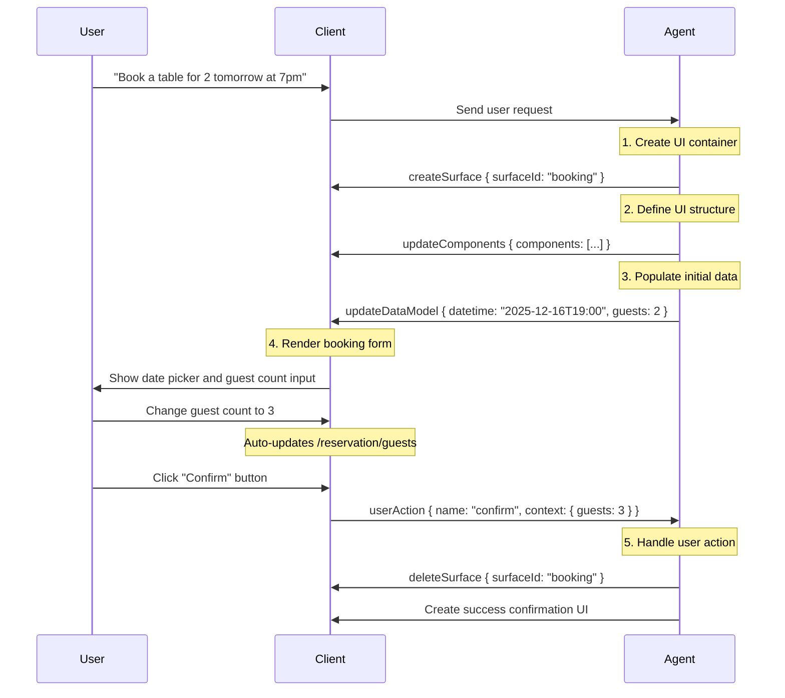

# @ant-design/x-card

`@ant-design/x-card` is a dynamic card rendering component based on the [A2UI protocol](https://a2ui.org/concepts/data-flow/), enabling AI Agents to dynamically build and render interactive UIs through structured JSON message streams.

## What is A2UI?

A2UI (Agent-to-User Interface) is an open protocol that allows AI Agents to describe interaction intent through declarative JSON message sequences, which the frontend runtime dynamically renders into native UI components.

### Core Design Principles

A2UI is built on three core ideas:

1. **Streaming Messages**: UI updates flow from the Agent to the client as a sequence of JSON messages
2. **Declarative Components**: UI is described as data, not code
3. **Data Binding**: UI structure is decoupled from application state, enabling reactive updates

### Why A2UI?

Unlike traditional approaches where AI generates HTML directly, A2UI uses structured data streams with significant advantages:

| Feature | A2UI | AI-generated HTML |
| --- | --- | --- |
| **Security** | Only uses predefined component catalog, no code execution risk | May contain malicious scripts, injection risk |
| **Cross-platform** | One data structure auto-adapts to Web, mobile, and other native components | HTML requires extra adaptation per platform |
| **Streaming Rendering** | Supports progressive rendering for smooth UX | Requires complete response before rendering |
| **LLM-friendly** | Flat JSON structure supports incremental generation, reduces AI burden | Requires generating full HTML structure, prone to syntax errors |
| **Maintenance** | Components managed centrally, updates only require client library changes | Each HTML interface needs individual debugging |

## Data Flow Architecture

A2UI follows the unidirectional data flow principle, ensuring predictable data direction:

```
Agent (LLM) → A2UI Generator → Transport (SSE/WebSocket/A2A)
                    ↓
Client (Stream Reader) → Message Parser → Renderer → Native UI
```

### Data Flow Lifecycle

Using a restaurant booking as an example:



## Protocol Versions

`@ant-design/x-card` supports both v0.8 and v0.9 of the A2UI protocol. Understanding the differences helps you choose the right version and migrate if needed.

### Version Comparison

| Feature | v0.8 | v0.9 |
| --- | --- | --- |
| **Version field** | No explicit version field | Explicit `version: 'v0.9'` field |
| **Surface creation** | Implicit (auto-created on first updateComponents) | Explicit `createSurface` command |
| **Data model update** | Uses `contents` array | Uses `path` and `value` fields |
| **Component definition** | More complex nested structure | Simpler flat structure |
| **Recommendation** | Deprecated, compatibility only | **Recommended** |

### v0.8 Message Format (Deprecated)

v0.8 uses implicit Surface creation — a Surface is automatically created when the Agent sends the first `updateComponents`:

```typescript
// v0.8 has no explicit version field
{
  updateComponents: {
    surfaceId: 'booking',
    catalogId: 'https://example.com/catalogs/booking/v1/catalog.json',
    components: [
      {
        id: 'root',
        component: 'Column',
        children: ['header', 'content']
      }
    ]
  }
}
```

**Data model updates** use the `contents` array:

```typescript
{
  updateDataModel: {
    surfaceId: 'booking',
    contents: [
      {
        op: 'replace',
        path: '/reservation/guests',
        value: 3
      }
    ]
  }
}
```

### v0.9 Message Format (Recommended)

v0.9 introduces explicit version identification and a Surface creation command, making the protocol clearer and more controllable:

```typescript
// Explicitly create Surface
{
  version: 'v0.9',
  createSurface: {
    surfaceId: 'booking',
    catalogId: 'https://example.com/catalogs/booking/v1/catalog.json'
  }
}

// Update components
{
  version: 'v0.9',
  updateComponents: {
    surfaceId: 'booking',
    components: [
      {
        id: 'root',
        component: 'Column',
        children: ['header', 'content']
      }
    ]
  }
}
```

**Data model updates** use the more intuitive `path` and `value` fields:

```typescript
{
  version: 'v0.9',
  updateDataModel: {
    surfaceId: 'booking',
    path: '/reservation/guests',
    value: 3
  }
}
```

### Migration Guide

If you are using v0.8, follow these steps to migrate to v0.9:

#### 1. Add Version Field

Add `version: 'v0.9'` to all messages:

```typescript
// v0.8
{ updateComponents: { ... } }

// v0.9
{ version: 'v0.9', updateComponents: { ... } }
```

#### 2. Explicitly Create Surface

Send `createSurface` before `updateComponents`:

```typescript
// v0.8: implicit creation
{ updateComponents: { surfaceId: 'booking', catalogId: '...', components: [...] } }

// v0.9: explicit creation
[
  { version: 'v0.9', createSurface: { surfaceId: 'booking', catalogId: '...' } },
  { version: 'v0.9', updateComponents: { surfaceId: 'booking', components: [...] } }
]
```

#### 3. Simplify Data Model Updates

Replace the `contents` array with `path` + `value`:

```typescript
// v0.8
{
  updateDataModel: {
    surfaceId: 'booking',
    contents: [
      { op: 'replace', path: '/guests', value: 3 }
    ]
  }
}

// v0.9
{
  version: 'v0.9',
  updateDataModel: {
    surfaceId: 'booking',
    path: '/guests',
    value: 3
  }
}
```

#### 4. Batch Data Updates

v0.9 supports updating entire objects, reducing message count:

```typescript
// v0.8: multiple messages required
[
  { updateDataModel: { surfaceId: 'booking', contents: [{ op: 'add', path: '/date', value: '2025-12-16' }] } },
  { updateDataModel: { surfaceId: 'booking', contents: [{ op: 'add', path: '/guests', value: 2 }] } }
]

// v0.9: one message is enough
{
  version: 'v0.9',
  updateDataModel: {
    surfaceId: 'booking',
    path: '/reservation',
    value: { date: '2025-12-16', guests: 2 }
  }
}
```

### Backward Compatibility

`@ant-design/x-card` supports both versions simultaneously:

```tsx
import type { XAgentCommand_v0_8, XAgentCommand_v0_9 } from '@ant-design/x-card';

// Auto-detect version and handle correctly
const commands: (XAgentCommand_v0_8 | XAgentCommand_v0_9)[] = [
  // v0.8 message
  {
    updateComponents: {
      /* ... */
    },
  },

  // v0.9 message
  {
    version: 'v0.9',
    createSurface: {
      /* ... */
    },
  },
];

<XCard.Box commands={commands}>{/* ... */}</XCard.Box>;
```

The component automatically detects the protocol version based on the presence of the `version` field and handles messages correctly.

## Core Message Types

`@ant-design/x-card` fully implements the A2UI v0.9 core command system:

### 1. createSurface — Create UI Container

Creates a new UI container (Surface). Each Surface has its own independent component tree and data model.

```typescript
{
  version: 'v0.9',
  createSurface: {
    surfaceId: 'booking',  // Unique surface identifier
    catalogId: 'https://example.com/catalogs/booking/v1/catalog.json'  // Component catalog
  }
}
```

### 2. updateComponents — Update Component Structure

Defines or updates UI components in a Surface using the adjacency list model.

```typescript
{
  version: 'v0.9',
  updateComponents: {
    surfaceId: 'booking',
    components: [
      { id: 'root', component: 'Column', children: ['header', 'guests-field', 'submit-btn'] },
      { id: 'header', component: 'Text', text: 'Confirm Reservation', variant: 'h1' },
      { id: 'guests-field', component: 'TextField', label: 'Guests', value: { path: '/reservation/guests' } },
      {
        id: 'submit-btn',
        component: 'Button',
        variant: 'primary',
        child: 'submit-text',
        action: {
          event: { name: 'confirm', context: { details: { path: '/reservation' } } }
        }
      }
    ]
  }
}
```

### 3. updateDataModel — Update Data Model

Updates the Surface's application state, triggering reactive UI updates.

```typescript
{
  version: 'v0.9',
  updateDataModel: {
    surfaceId: 'booking',
    path: '/reservation',
    value: {
      datetime: '2025-12-16T19:00:00Z',
      guests: 2
    }
  }
}
```

### 4. deleteSurface — Delete Surface

Removes the specified Surface and all its components and data model.

```typescript
{
  version: 'v0.9',
  deleteSurface: {
    surfaceId: 'booking'
  }
}
```

## Data Binding System

A2UI separates UI structure from application state, enabling reactive updates through data binding.

### Data Model

Each Surface has an independent JSON data model:

```json
{
  "user": { "name": "Alice", "email": "alice@example.com" },
  "reservation": { "datetime": "2025-12-16T19:00:00Z", "guests": 2 }
}
```

### JSON Pointer Paths

Uses RFC 6901 standard JSON Pointer to access

- `/user/name` → `"Alice"`
- `/reservation/guests` → `2`

### Literal vs. Path Binding

Component properties can use literal values or data binding:

```typescript
// Literal (static)
{ id: 'title', component: 'Text', text: 'Welcome' }

// Path binding (dynamic)
{ id: 'username', component: 'Text', text: { path: '/user/name' } }
```

When `/user/name` changes from `"Alice"` to `"Bob"`, the text updates automatically.

### Two-way Binding

Interactive components can automatically update the data model:

```typescript
{ id: 'name-input', component: 'TextField', value: { path: '/form/name' } }
```

User input automatically updates `/form/name`.

## Action Event Handling

User interactions are passed back to the Agent via action events.

```typescript
// Component definition
{
  id: 'submit-btn',
  component: 'Button',
  action: {
    event: {
      name: 'confirm_booking',
      context: {
        date: { path: '/reservation/datetime' },
        guests: { path: '/reservation/guests' }
      }
    }
  }
}
```

When the user clicks the button, the client sends:

```typescript
{
  version: 'v0.9',
  action: {
    name: 'confirm_booking',
    surfaceId: 'booking',
    sourceComponentId: 'submit-btn',
    timestamp: '2025-12-16T19:05:00Z',
    context: { date: '2025-12-16T19:00:00Z', guests: 3 }
  }
}
```

## Component Catalog

The Catalog defines available components and their property schemas, ensuring type safety and validation.

```typescript
registerCatalog(catalog);

<XCard.Box
  components={{
    Text: MyTextComponent,
    Button: MyButtonComponent,
    TextField: MyTextFieldComponent,
  }}
>
  {/* ... */}
</XCard.Box>;
```

## Core Features

### 1. Progressive Rendering

Users see the UI build up incrementally without waiting for the full response.

### 2. Adjacency List Model

Uses a flat component list instead of a nested tree structure — LLM-friendly, supports incremental updates, and fault-tolerant.

### 3. Component Validation

Automatically validates component properties against the Catalog. Friendly errors in development, graceful degradation in production.

### 4. Type Safety

Full TypeScript type definitions:

```typescript
import type {
  XAgentCommand_v0_9,
  XAgentCommand_v0_8,
  ActionPayload,
  Catalog,
  CatalogComponent,
} from '@ant-design/x-card';
```

## Installation

```bash
npm install @ant-design/x-card
# or
yarn add @ant-design/x-card
# or
pnpm add @ant-design/x-card
```

## Quick Start

```tsx
import { XCard, registerCatalog } from '@ant-design/x-card';
import type { XAgentCommand_v0_9, Catalog, ActionPayload } from '@ant-design/x-card';

const catalog: Catalog = {
  catalogId: 'my-app-catalog',
  components: {
    Text: {
      /* ... */
    },
    Button: {
      /* ... */
    },
  },
};

registerCatalog(catalog);

const commands: XAgentCommand_v0_9[] = [
  { version: 'v0.9', createSurface: { surfaceId: 'booking', catalogId: 'my-app-catalog' } },
  {
    version: 'v0.9',
    updateComponents: {
      surfaceId: 'booking',
      components: [
        /* ... */
      ],
    },
  },
];

function App() {
  const handleAction = (payload: ActionPayload) => {
    console.log('Action triggered:', payload.name, payload.context);
  };

  return (
    <XCard.Box
      commands={commands}
      onAction={handleAction}
      components={{ Text: MyTextComponent, Button: MyButtonComponent }}
    >
      <XCard.Card id="booking" />
    </XCard.Box>
  );
}
```

## Use Cases

- **AI Assistant UIs**: Let AI Agents dynamically generate forms, cards, and interactive interfaces
- **Smart Forms**: Dynamically adjust form structure and validation rules based on user input
- **Data Visualization**: Dynamically generate charts, lists, and data display components
- **Workflow Orchestration**: Render different stage UIs based on business processes
- **Multi-turn Conversations**: Embed dynamic interactive components in chat interfaces
- **Personalized UIs**: Customize UI based on user preferences and usage scenarios

## Next Steps

- See [A2UI v0.9](/x-card/a2ui-v0.9) for the latest protocol spec and examples
- Read the [A2UI Official Docs](https://a2ui.org/concepts/data-flow/) for protocol design philosophy
- Browse [Component Structure](https://a2ui.org/concepts/component-structure/) to learn the adjacency list model
- Reference [Data Binding](https://a2ui.org/concepts/data-binding/) to master reactive updates
