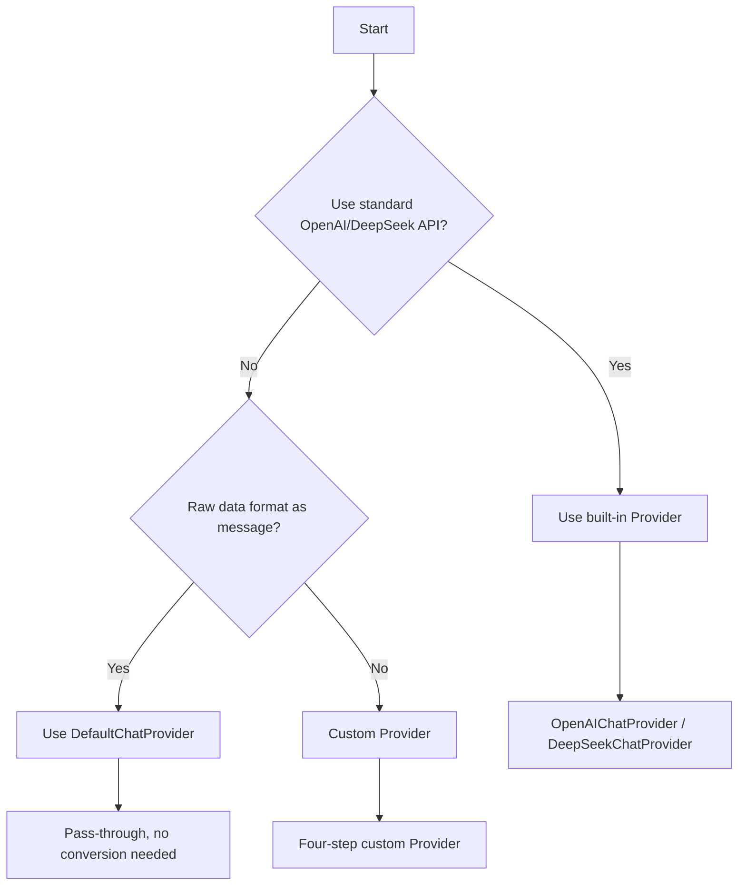

# 🎯 Skill Positioning

**This skill focuses on solving one problem**: How to quickly adapt your streaming interface to Ant Design X's Chat Provider.

**Not involved**: useXChat usage tutorial (that's another skill).

## Table of Contents

- [📦 Technology Stack Overview](#-technology-stack-overview)
- [🚀 Quick Start](#-quick-start)
  - [Built-in Provider](#built-in-provider)
  - [When to Use Custom Provider](#when-to-use-custom-provider)
- [📋 Four Steps to Implement Custom Provider](#-four-steps-to-implement-custom-provider)
- [🔑 Core Types and Exports](#-core-types-and-exports)
- [⚙️ XRequest Advanced Configuration](#️-xrequest-advanced-configuration)
  - [callbacks](#callbacks)
  - [retryInterval Retry](#retryinterval-retry)
  - [transformStream Custom Stream](#transformstream-custom-stream)
- [🔧 Common Scenario Adaptation](#-common-scenario-adaptation)
- [⚠️ Important Reminders](#️-important-reminders)
- [⚡ Quick Checklist](#-quick-checklist)
- [🚨 Development Rules](#-development-rules)
- [🔗 Reference Resources](#-reference-resources)

# 📦 Technology Stack Overview

| Layer            | Package Name               | Core Purpose               |
| ---------------- | -------------------------- | -------------------------- |
| **UI Layer**     | **@ant-design/x**          | React UI component library |
| **Logic Layer**  | **@ant-design/x-sdk**      | Development toolkit        |
| **Render Layer** | **@ant-design/x-markdown** | Markdown renderer          |

```ts
// ✅ Correct import examples
import { Bubble } from '@ant-design/x';
import { AbstractChatProvider, OpenAIChatProvider } from '@ant-design/x-sdk';
import XRequest from '@ant-design/x-sdk';
```

# 🚀 Quick Start

### 🎯 Provider Selection Decision Tree



### 🏭 Built-in Provider Overview

| Provider Type | Applicable Scenario | Import |
| --- | --- | --- |
| **OpenAIChatProvider** | Standard OpenAI API format | `import { OpenAIChatProvider } from '@ant-design/x-sdk'` |
| **DeepSeekChatProvider** | Standard DeepSeek API format | `import { DeepSeekChatProvider } from '@ant-design/x-sdk'` |
| **DefaultChatProvider** | Pass-through raw response, no format conversion | `import { DefaultChatProvider } from '@ant-design/x-sdk'` |

> ⚠️ Export names are `OpenAIChatProvider` / `DeepSeekChatProvider` / `DefaultChatProvider`, watch spelling

#### DefaultChatProvider Use Case

`DefaultChatProvider` **passes through raw response data** without any conversion. Suitable for:

- The interface response format is already what you want to display
- You want full control over `Bubble.List`'s `contentRender` to render messages

```ts
import { DefaultChatProvider, XRequest } from '@ant-design/x-sdk';

interface ChatInput {
  query: string;
  stream?: boolean;
}

interface ChatOutput {
  choices: Array<{ message: { content: string; role: string } }>;
}

// DefaultChatProvider generic: <ChatMessage, Input, Output>
// ChatMessage is your Output type (passed through directly)
const provider = new DefaultChatProvider<ChatOutput | ChatInput, ChatInput, ChatOutput>({
  request: XRequest('https://your-api.com/chat', {
    manual: true,
    params: { stream: false },
  }),
});

// Render using contentRender in Bubble.List's role config
// role={{ assistant: { contentRender(content) { return content?.choices?.[0]?.message?.content } } }}
```

> ⚠️ When using `DefaultChatProvider`, `ChatMessage` is typically your `Output` type or a union type; rendering requires `contentRender`

# 📋 Four Steps to Implement Custom Provider

## Step 1: Analyze Interface Format ⏱️ 2 minutes

| Information Type    | Example Value               |
| ------------------- | --------------------------- |
| **Interface URL**   | `https://your-api.com/chat` |
| **Request Method**  | JSON, POST                  |
| **Response Format** | Server-Sent Events          |
| **Auth Method**     | Bearer Token                |

## Step 2: Create Provider Class ⏱️ 5 minutes

```ts
// MyChatProvider.ts
import { AbstractChatProvider } from '@ant-design/x-sdk';
import type { TransformMessage } from '@ant-design/x-sdk';
import type { XRequestOptions } from '@ant-design/x-sdk';

interface MyInput {
  query: string;
  model?: string;
  stream?: boolean;
}

interface MyOutput {
  content: string;
  finish_reason?: string;
}

interface MyMessage {
  content: string;
  role: 'user' | 'assistant';
}

export class MyChatProvider extends AbstractChatProvider<MyMessage, MyInput, MyOutput> {
  // Parameter conversion: merge onRequest params + XRequest default params
  // options comes from XRequest(url, options), can access options.params etc.
  transformParams(
    requestParams: Partial<MyInput>,
    options: XRequestOptions<MyInput, MyOutput, MyMessage>,
  ): MyInput {
    return {
      ...(options?.params || {}),
      query: requestParams.query || '',
      model: 'gpt-3.5-turbo',
      stream: true,
    };
  }

  // Local message: convert onRequest params to the user-side display message (can return array)
  transformLocalMessage(requestParams: Partial<MyInput>): MyMessage {
    return {
      content: requestParams.query || '',
      role: 'user',
    };
  }

  // Response conversion:
  // info.originMessage: previous content of this message (for stream accumulation)
  // info.chunk: current streaming chunk
  // info.chunks: all received chunks (used in onSuccess)
  // info.status: current status
  // ⚠️ Return only MyMessage type; do NOT add a status field
  transformMessage(info: TransformMessage<MyMessage, MyOutput>): MyMessage {
    const { originMessage, chunk } = info;

    if (!chunk?.content || chunk.content === '[DONE]') {
      return { ...(originMessage || { content: '', role: 'assistant' }) };
    }

    return {
      content: `${originMessage?.content || ''}${chunk.content}`,
      role: 'assistant',
    };
  }
}
```

## Step 3: Verify ⏱️ 1 minute

| Check Item                    | Description                                                   |
| ----------------------------- | ------------------------------------------------------------- |
| **Only 3 methods**            | transformParams, transformLocalMessage, transformMessage      |
| **transformParams signature** | Must include second parameter `options: XRequestOptions<...>` |
| **No status in return**       | transformMessage return value has no status field             |
| **No request method**         | Confirm no request method implemented                         |
| **Type check passes**         | `tsc --noEmit` no errors                                      |

## Step 4: Use Provider ⏱️ 1 minute

```ts
import { MyChatProvider } from './MyChatProvider';
import XRequest from '@ant-design/x-sdk';

// ⚠️ Must pass manual: true, otherwise AbstractChatProvider constructor will throw
const provider = new MyChatProvider({
  request: XRequest('https://your-api.com/chat', {
    manual: true,
    headers: {
      Authorization: 'Bearer your-token',
      'Content-Type': 'application/json',
    },
    params: {
      model: 'gpt-3.5-turbo',
      stream: true,
    },
  }),
});

export { provider };
```

# 🔑 Core Types and Exports

Key types exported from `@ant-design/x-sdk`:

```ts
import type {
  // OpenAI standard message format
  XModelMessage, // { role: string; content: string | { text: string; type: string } }
  XModelParams, // Full OpenAI request params type (model, messages, stream, temperature, etc.)
  XModelResponse, // Full OpenAI response type (choices, usage, etc.)

  // SSE stream field types
  SSEFields, // 'data' | 'event' | 'id' | 'retry'
  SSEOutput, // Partial<Record<SSEFields, any>>

  // Provider related
  TransformMessage, // { originMessage, chunk, chunks, status, responseHeaders }

  // XRequest related
  XRequestOptions, // Full request config
  XRequestCallbacks, // { onUpdate, onSuccess, onError }

  // Message related
  MessageInfo, // { id, message, status, extraInfo }
} from '@ant-design/x-sdk';
```

### XModelMessage Structure (OpenAI message format)

```ts
// XModelMessage is the standard OpenAI message format
// Used for OpenAIChatProvider / DeepSeekChatProvider ChatMessage generic
const userMessage: XModelMessage = { role: 'user', content: 'Hello' };
const systemMessage: XModelMessage = { role: 'system', content: 'You are an assistant' };
const developerMessage: XModelMessage = { role: 'developer', content: 'System prompt' };
```

### SSEOutput and SSEFields

```ts
// SSEOutput is the type for raw SSE stream data
// { data?: string; event?: string; id?: string; retry?: number }
// DeepSeekChatProvider uses Partial<Record<SSEFields, XModelResponse>>

import { DeepSeekChatProvider, XRequest } from '@ant-design/x-sdk';
import type { SSEFields, XModelParams, XModelResponse } from '@ant-design/x-sdk';

const provider = new DeepSeekChatProvider({
  request: XRequest<XModelParams, Partial<Record<SSEFields, XModelResponse>>>(
    'https://api.deepseek.com/v1/chat/completions',
    {
      manual: true,
      params: { model: 'deepseek-chat', stream: true },
    },
  ),
});
```

# ⚙️ XRequest Advanced Configuration

## callbacks

`callbacks` allows monitoring request events at the Provider level. The third parameter in callbacks is the `MessageInfo` processed by `transformMessage`:

```ts
const provider = new OpenAIChatProvider({
  request: XRequest<XModelParams, XModelResponse, XModelMessage>(BASE_URL, {
    manual: true,
    callbacks: {
      // onUpdate: triggered on each streaming chunk arrival
      // chunk: current chunk; responseHeaders: response headers; message: current MessageInfo
      onUpdate: (chunk, responseHeaders, message) => {
        console.log('Stream update:', message?.message?.content);
      },
      // onSuccess: triggered when all chunks are received
      // chunks: all chunks array; message: final MessageInfo
      onSuccess: (chunks, responseHeaders, message) => {
        console.log('Request complete:', message?.message?.content);
        // Good place for analytics, logging, etc.
      },
      // onError: triggered on request failure (including AbortError)
      // error: error object; errorInfo: extra error info; message: MessageInfo at failure
      onError: (error, errorInfo, responseHeaders, message) => {
        console.error('Request failed:', error.message);
      },
    },
    params: { model: 'gpt-4o', stream: true },
  }),
});
```

> ⚠️ `callbacks` and `useXChat`'s `requestFallback` do not conflict — both execute. `callbacks` is better for logging/reporting; `requestFallback` controls UI display.

## retryInterval Retry

```ts
const request = XRequest('https://your-api.com/chat', {
  manual: true,
  // Retry interval after failure (ms)
  retryInterval: 3000,
  // Max retry count (unlimited if not set)
  retryTimes: 3,
  // onError can also return a number to dynamically set retry interval
  callbacks: {
    onError: (error) => {
      if (error.name === 'AbortError') return; // Don't retry on user cancel
      return 5000; // Return number = retry after 5s (higher priority than retryInterval)
    },
  },
});
```

## transformStream Custom Stream

Use when the server returns a non-standard SSE stream format:

```ts
const request = XRequest('https://your-api.com/chat', {
  manual: true,
  // Fixed TransformStream
  transformStream: new TransformStream({
    transform(chunk, controller) {
      controller.enqueue(JSON.parse(chunk));
    },
  }),
  // Or decide dynamically based on URL and response headers
  transformStream: (baseURL, responseHeaders) => {
    if (responseHeaders.get('x-stream-type') === 'ndjson') {
      return new TransformStream({
        /* ... */
      });
    }
    return undefined; // Use default SSE parsing
  },
});
```

# 🔧 Common Scenario Adaptation

> 📖 **Complete Examples**: [EXAMPLES.md](reference/EXAMPLES.md)

| Scenario Type             | Difficulty | Description                                  |
| ------------------------- | ---------- | -------------------------------------------- |
| **Standard OpenAI**       | 🟢         | Use built-in `OpenAIChatProvider` directly   |
| **Standard DeepSeek**     | 🟢         | Use built-in `DeepSeekChatProvider` directly |
| **Pass-through raw data** | 🟢         | Use `DefaultChatProvider`                    |
| **Private SSE API**       | 🟡         | Four-step custom Provider                    |
| **Multi-field response**  | 🟡         | Custom Provider + complex ChatMessage        |
| **Non-SSE stream**        | 🔴         | Custom Provider + transformStream            |

# ⚠️ Important Reminders

### 🚨 Mandatory Rule: Never write a request method!

```ts
// ❌ Serious error
class MyProvider extends AbstractChatProvider {
  async request(params: any) {
    /* Forbidden! */
  }
}

// ✅ Only correct approach: implement only the three conversion methods
class MyProvider extends AbstractChatProvider {
  transformParams(params, options) {
    /* ... */
  }
  transformLocalMessage(params) {
    /* ... */
  }
  transformMessage(info) {
    /* ... */
  }
}
```

### ⚠️ transformMessage must not return status

```ts
// ❌ Wrong
transformMessage(info) {
  return { content: '...', status: 'error' }; // ❌ status is managed by the framework
}

// ✅ Correct
transformMessage(info) {
  return { content: '...' }; // ✅
}
```

### ⚠️ Provider instantiation notes

```ts
// ✅ In React components, use useState to ensure only created once
const [provider] = React.useState(
  new MyChatProvider({
    request: XRequest(URL, { manual: true }),
  }),
);

// ❌ Don't create directly in render function (creates new instance on every render)
// const provider = new MyChatProvider(...); // inside component body causes issues
```

# ⚡ Quick Checklist

Before creating Provider:

- [ ] Have interface docs and response format
- [ ] Confirmed whether custom is needed (or if built-in Provider suffices)
- [ ] Defined Input, Output, ChatMessage types

After completion:

- [ ] **Only implemented the three required methods**
- [ ] **transformParams includes second parameter options**
- [ ] **transformMessage return value has no status field**
- [ ] **XRequest configured with manual: true**
- [ ] **Absolutely no request method implemented**
- [ ] Provider wrapped with `useState` in React component
- [ ] Type check passes (`tsc --noEmit`)

# 🚨 Development Rules

- **If the user does not explicitly need test cases, do not add test files**
- **After completion, must check types**: Run `tsc --noEmit` to ensure no type errors
- **Keep code clean**: Remove all unused variables and imports

# 🔗 Reference Resources

## 📚 Core Reference Documentation

- [EXAMPLES.md](reference/EXAMPLES.md) - Practical example code

## 🌐 SDK Official Documentation

- [useXChat Official Documentation](https://github.com/ant-design/x/blob/main/packages/x/docs/x-sdk/use-x-chat.en-US.md)
- [XRequest Official Documentation](https://github.com/ant-design/x/blob/main/packages/x/docs/x-sdk/x-request.en-US.md)
- [Chat Provider Official Documentation](https://github.com/ant-design/x/blob/main/packages/x/docs/x-sdk/chat-provider.en-US.md)

## 💻 Example Code

- [custom-provider-width-ui.tsx](https://github.com/ant-design/x/blob/main/packages/x/docs/x-sdk/demos/chat-providers/custom-provider-width-ui.tsx)
- [openai-callback.tsx](https://github.com/ant-design/x/blob/main/packages/x/docs/x-sdk/demos/x-chat/openai-callback.tsx)
